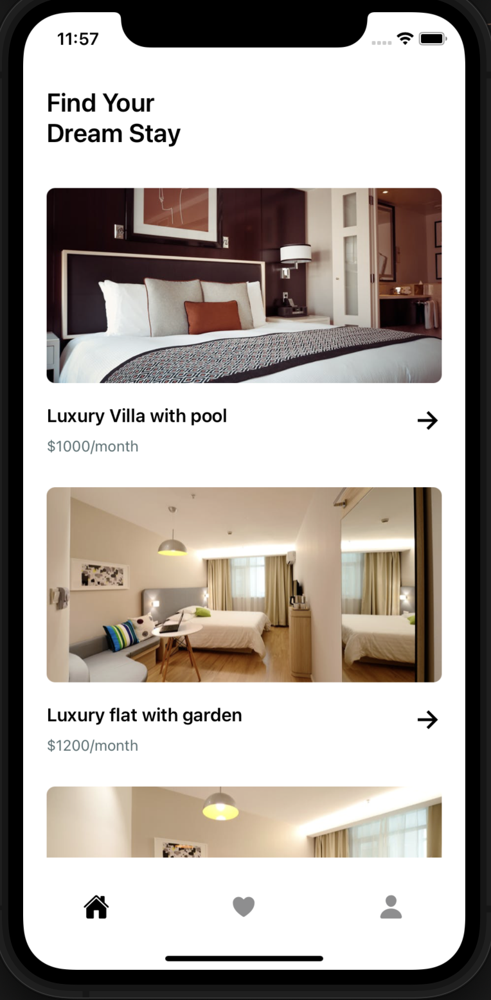
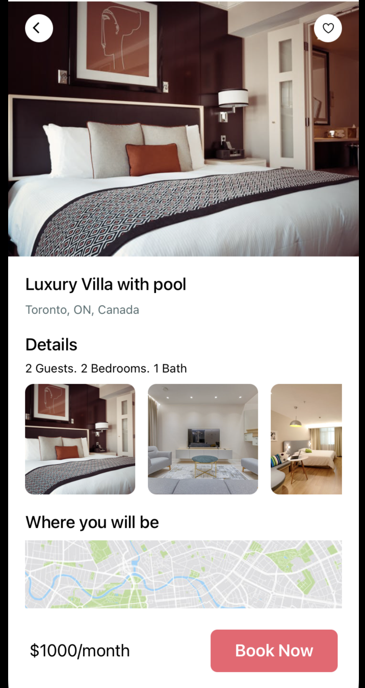
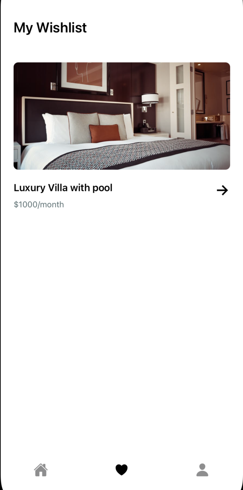
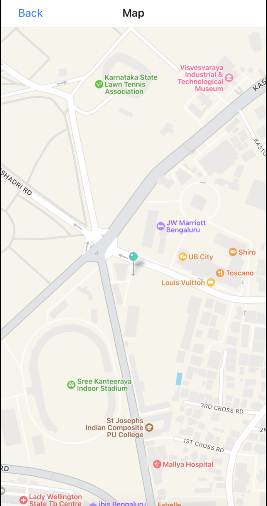

<h1 align="center"><b>🏡 Real Estate Mobile App</b></h1>
<p align="center">
  A Real Estate App built with React Native(supports both IOS and Andriod)
</p>

<p align="center">
  
  
  
  
</p>


## Getting Started

**1. Clone this repository, go to the root directory and install packages**

```bash
npm install
```

**2. Run dev**

```bash
npm start
```

**3.  To view/run the app locally**

```
Either open in andriod simulator or Xcode
Another option is to open on Expo go app (available in Play Store and App Store)
Scan the QR code shown in the terminal(paste url) using Expo Go app
```
Note: Images are taken from pexels
